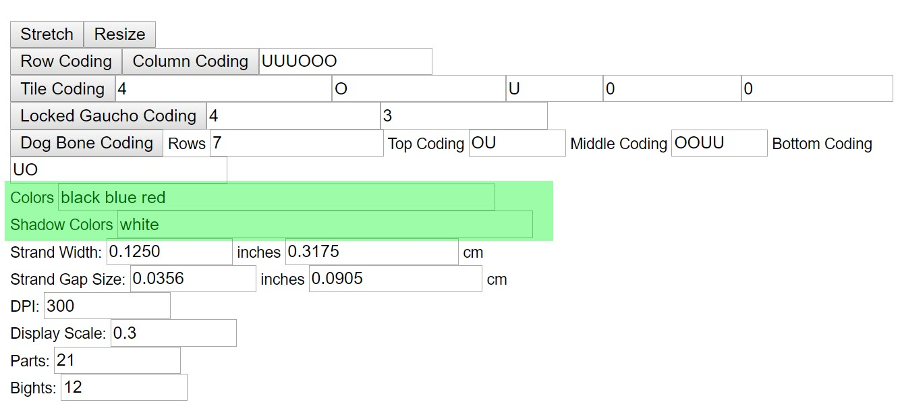
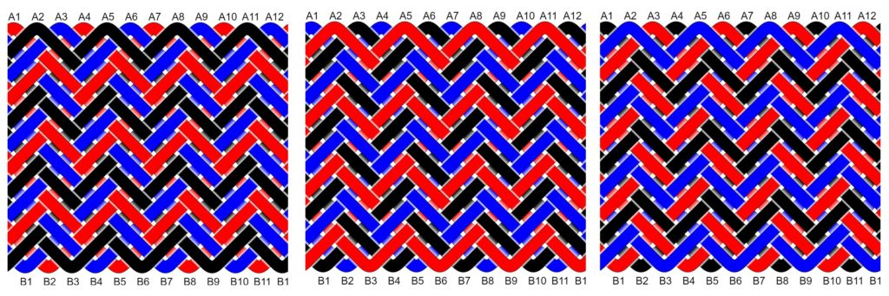

# AGM: Colors & Shadow Colors

One of the best parts about AGM is how it uses color to generate the pattern image and run list. It's a great way to visualize how the choice of color and order changes how a knot can look. 

## The UI

The following image highlights the `Colors` and `Shadow Colors` fields. 

## Strand Colors

In the `Color` field, enter one HTML color for each strand. 

* List of HTML color names:  [Picker: Color Names](https://htmlcolorcodes.com/color-names/)
* Separate each color with a space – not a comma.
* Common names like black, white, gray, red, blue, and green all work.
* Duplicate colors are allowed. 
* Glitchy – After changing a color, leave this field by hitting the `Tab` key. If you click away to another field or button, the pattern may not update.

## Shadow Colors

The `Shadow Color` field is only used to generate the image – it’s meant to help make crossings easier to see.

I generally stick with white when my strands are dark, and black when my strands are light – but you can use any color you like.

## Color Order Matters

Some knots can look drastically different depending on the order of strand colors. Here’s a herringbone interweave using the same 3 colors in different orders.

