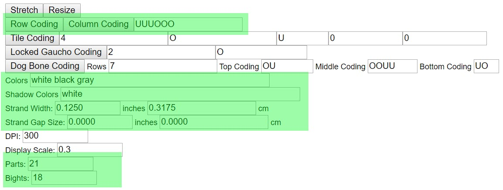
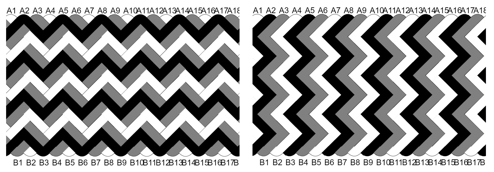
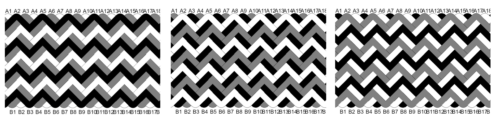

# AGM: Gaucho Fan & Herringbone Knots

How to use Advanced Grid Maker to generate instructions & images for the Herringbone and Gaucho Fan knots. Both knots are accomplished by weaving together multiple Turk's Head knots following a specific pattern. 

This tutorial is best if you are already familiar with the basic AGM features and with Turk's Head knots. 

## The UI

The image below highlights the settings needed for both knots.

## Bights & Parts

The Herringbone & Gaucho Fan are accomplished by interweaving multiple Turk's Head knots. The easiest way to use AGM for these knots is to start with a mathematically possible Turk's Head. 

* [Basics: Counting Bights & Parts](../basics/count-bights-parts.md)
* [Basics: Turk's Head Size Reference](../basics/turks-head-size-reference.md)

Let's say I want to make one of the knots below. The left is a Herringbone and the right is a Gaucho Fan. 

Each knot has 3 strands - black, white, gray. Each strand is a 6B 7P Turk's Head. 

For AGM `Bights` and `Parts`, multiply the Turk's Head by the number of strands. Here it's 3 strands x 6B 7P = 18B 21P. 

## Coding & Pattern

A knot can use column coding or row coding. I don't understand this concept well enough to explain it - I can't even find an explanation simple enough to recommend :P The important thing is:

* Herringbone uses `Column Coding`.
* Gaucho Fan uses `Row Coding`. 

| **Strands**  | **Bights** | **Parts** | **Coding** |
|--------------|------------|-----------|------------|
| Turk's Head  | 6          | 7         | OU         |
| 2nd Strand   | 12         | 14        | OOUU       |
| 3rd Strand   | 18         | 21        | OOOUUU     |
| 4th Strand   | 24         | 28        | OOOOUUUU   |

IMPORTANT: Be sure to click the `Column Coding` button at least one time. Also click it any time you change the `OU` pattern. 

## Color Order

The image below shows how color order can drastically change the look of a knot - especially for the Herringbone. Be sure to experiment :)

