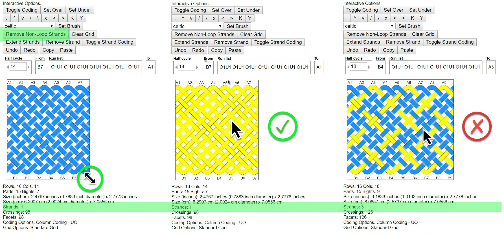
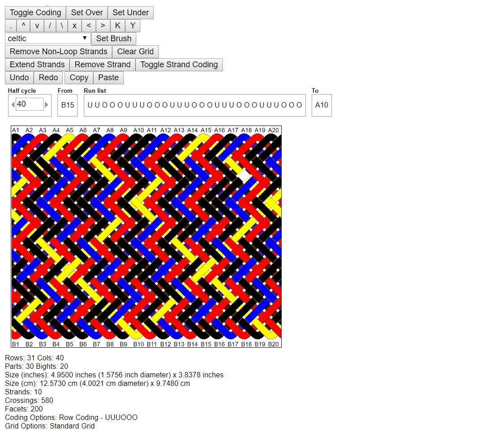

# AGM: Remove Non-Loop Strands

When using Advanced Grid Maker to design a knot, it can be hard to tell if the knot is properly formed. The `Remove Non-Loop Strands` feature is for locating strands where the working end should finish at the standing end but doesn’t.

This feature is especially useful when [resizing](agm-resize-stretch.md) the interactive image because the knot can look properly formed when it's not - `Remove Non-Loop Strands` is how to check.

## Single-Strand Example

The Turk's Head is a single-strand pattern where the working end meets the standing end, completing a 'loop'. 

The image below shows starting with the default Turk's Head and using the interactive image to resize the knot. After resizing, click the `Remove Non-Loop Strands` button and hover over the image. At this point, a few things may happen:

* The entire image disappears - This usually means the generated pattern is a single strand, but doesn't form a closed loop.
* Like the middle example, the entire strand turns a contrasting color - This means the strand is a properly formed, single, uninterrupted loop. 
* Like the example on the right, the strand turns multiple colors - This means AGM added strands to complete the pattern. You can also see the number of strands in the details below the image. 
* Nothing seems to happen - AGM is quirky. Click a different button then try again.  

## Multi-Strand Example

In this example, I’m dinking around with a 3-strand pattern that started as a gaucho fan. I want to stay with 3 strands.

Here, I’m hovering over the blue strand and only parts of it are turning yellow – meaning the blue is not a single, uninterrupted loop.

Again,  AGM is trying to use the info I’ve entered to create closed loop strands – while I only fed it 3 strands, it’s telling me I need 10 for this design.

