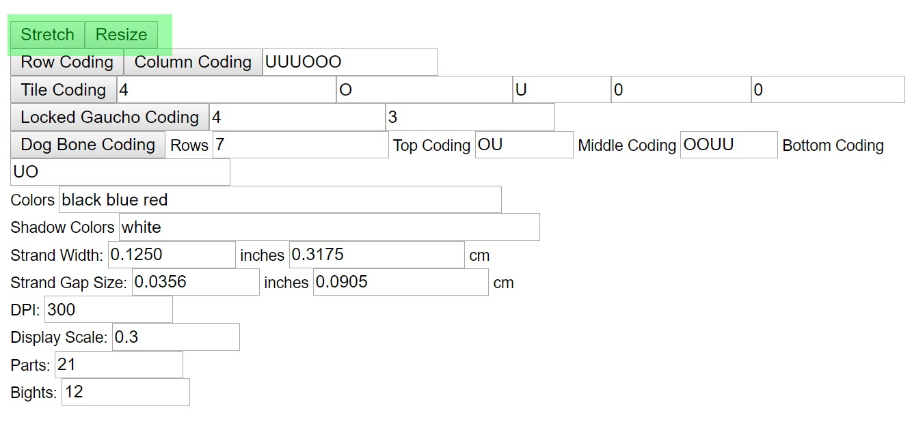

# AGM: Resize & Stretch

One of the coolest features of Advanced Grid Maker is the interactive image it creates and how you can use `Resize` and `Strectch` to visualize different sizes and dimensions of a knot. 

## The UI

The following image shows where the `Resize` and `Stretch` buttons are located - they're nowhere near the interactive image :P

## Resize

Click and drag the bottom-right corner of the interactive image to resize or stretch. 

AGM starts in `Resize` mode by default. Resizing changes the number of bights and parts - the details below the image update in real time. 

## Stretch

Change modes by clicking the `Stretch` button. Stretching changes the dimensions of the knot - it does not change the number of bights & parts. 

