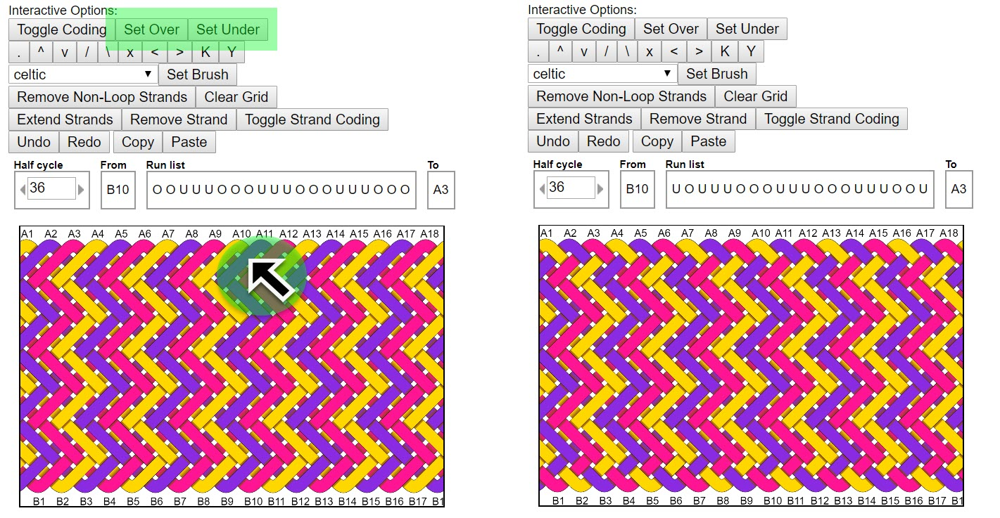

# AGM: Set Over & Set Under

One of the most useful features of Advanced Grid Maker is the ability to create custom designs. The Set Over and Set Under features let you switch individual crossings anywhere in a knot and are a great way to add detail or stability to a pattern. Here’s a quick example.

## Add Stability

One of my favorites uses for `Set Over` and `Set Under` is to add stability to interweaves like the 3-strand gaucho fan knot.

`Set Over` and `Set Under` work on the bottom strand of a crossing. To use, click either button and then click a strand crossing.

In this example, the left image shows a gaucho fan knot before making changes. The right images shows how I used `Set Over` to lock in the edge bights for stability – and you can use these features to add detail or stability anywhere in the knot.

