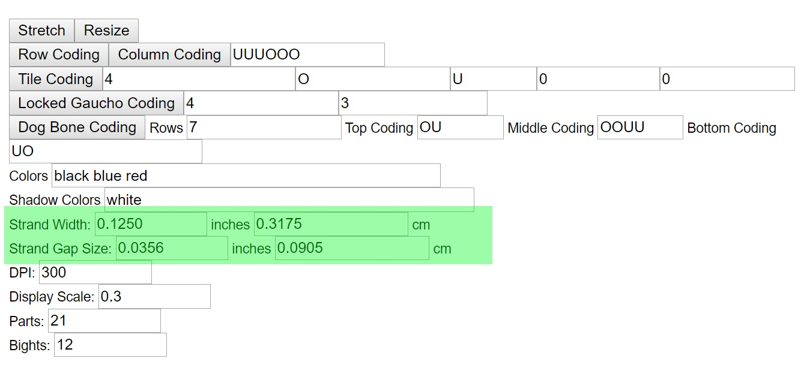
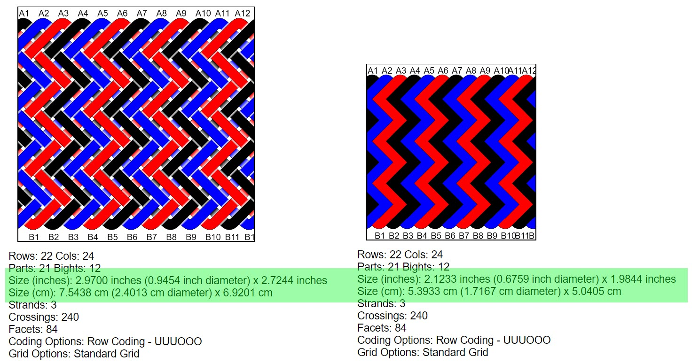

# AGM: Strand Width & Strand Gap

One of the most helpful things about Advanced Grid Maker is using `Strand Width` and `Strand Gap `to estimate the size of a knot and the length(s) of cord needed. Here’s a quick example – combine these with `Resize` and `Stretch` for even better estimates.

## The UI

* `Strand Width` is the cord diameter.
* `Strand Gap` is the amount of room between cords. 

## Size Estimates

For AGM to provide a good estimate of knot size and cord lengths, set `Strand Width`, `Strand Gap`, and `Stretch` as accurately as possible. This means factoring in how stretchy the cord is and how tight you tie. 

For example, I use a lot of paracord. Gutted and pressed flat, it’s easy to get an accurate width. On the other hand, un-gutted cord starts narrower and rounder, then gets a bit wider and flatter as it's tightened.

## Reference Images

Separate from size estimates, I use `Strand Width` and `Strand Gap` to generate a working reference image. `Strand Gap` is especially useful for adding space around crossings and seeing what’s underneath.

