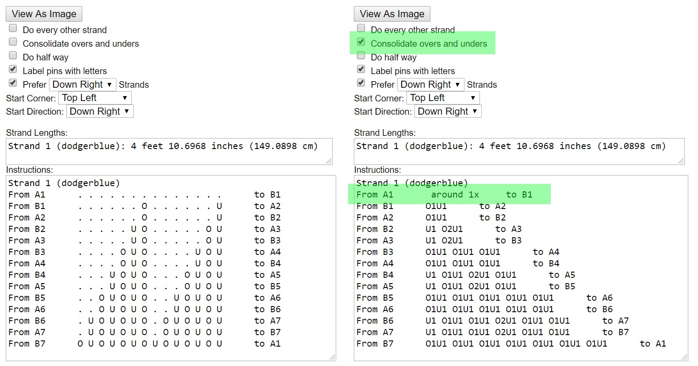

# AGM: Turk's Head Knots

How to use Advanced Grid Maker to create instructions and images for Turk's Head knot.

## The UI

The image below highlights the settings needed to create Turk's Head knots. 

## Column Coding

A knot can use column coding or row coding. I don't understand this concept well enough to explain it - I can't even find an explanation simple enough to recommend :P

The important thing is that the Turk's Head uses `Column Coding`. The pattern is `OU` - over one, under one. The opposite `UO` also works. 

IMPORTANT: Be sure to click the `Column Coding` button at least one time. Also click it any time you change the `OU` pattern. 

## Bights & Parts

The easiest way to use AGM for Turk's Head knots is to feed it a mathematically possible combination of `Bights` and `Parts`. 

* [Basics: Counting Bights & Parts](../basics/count-bights-parts.md)
* [Basics: Turk's Head Size Reference](../basics/turks-head-size-reference.md)

## Estimates

To learn more about creating physically & visually accurate size & cord length estimates, check out:

* [AGM: Strand Width & Strand Gap](./agm-strand-width-gap.md)
* [AGM: Resize & Stretch](./agm-resize-stretch.md)
* [AGM: Colors & Shadow Colors](./agm-colors-shadows.md)

## Interactive Image

When you change settings, AGM automatically updates the pattern image, the details seen just below the image, the instructions, and so on. 

The image itself is also interactive - you can click and drag the bottom-right corner to either [Resize or Stretch](./agm-resize-stretch.md) the pattern. 

If you `Resize` the knot in this way, use [Remove Non-Loop Strands](./agm-remove-non-loop-strands.md) and check the details to ensure the Turk's Head is still properly formed.

## Instructions

The image below shows the 2 types of instructions AGM can generate by toggling the `Consolidate overs and unders` checkbox. These instructions are for a 7B 15P Turk's Head.  

* The Dotted instructions on the left provide good visual cues about how far it is to the next crossing. 
* The consolidated instructions on the right make it clearer that the first move from `A1` to `B1` requires going around the mandrel or board 1 time.  

To learn more, see [How to Read Knot Instructions](../basics/read-knot-instructions.md). 

