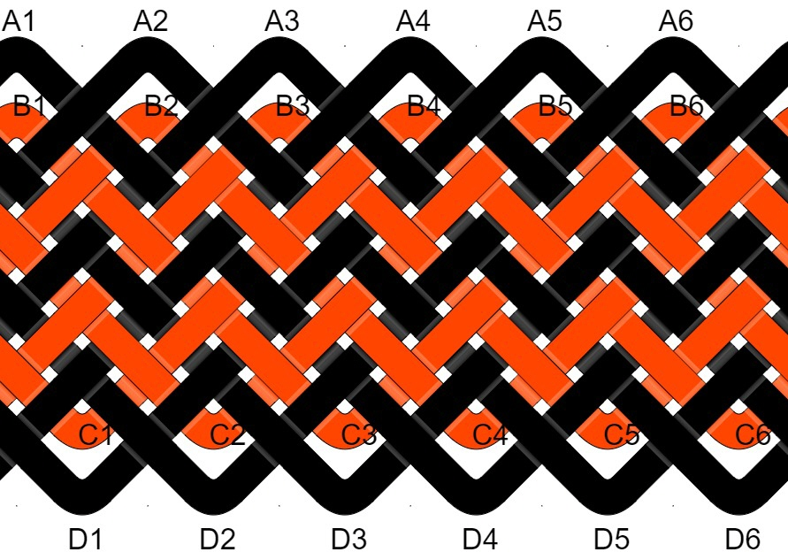
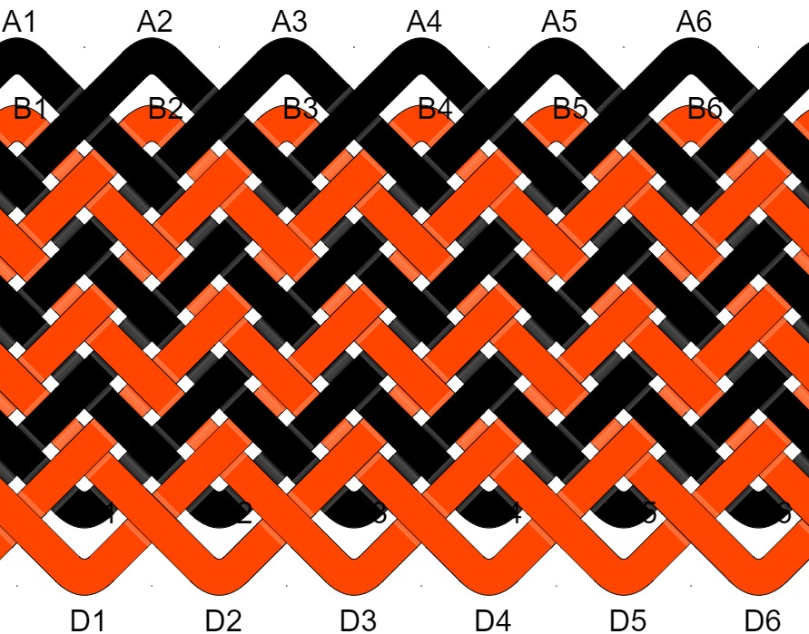
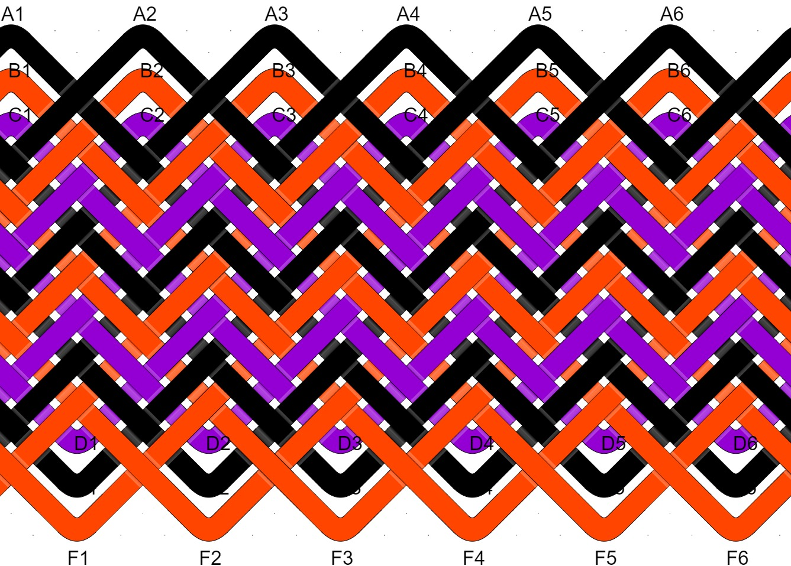
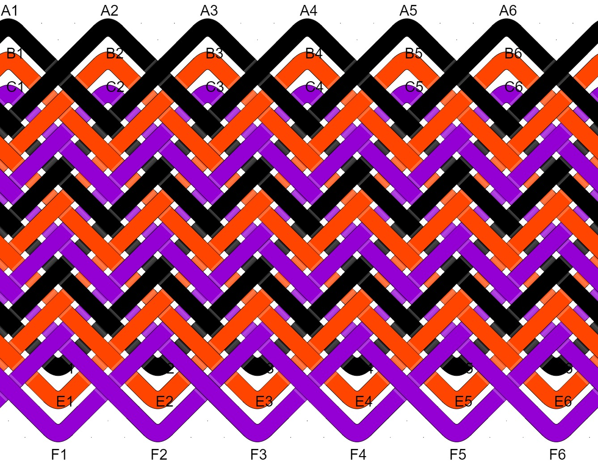
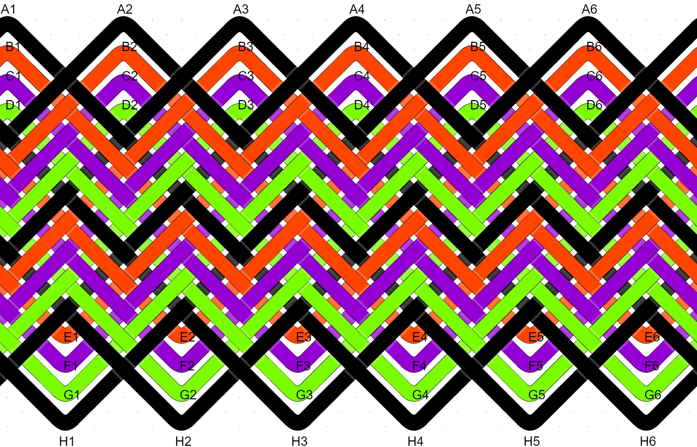
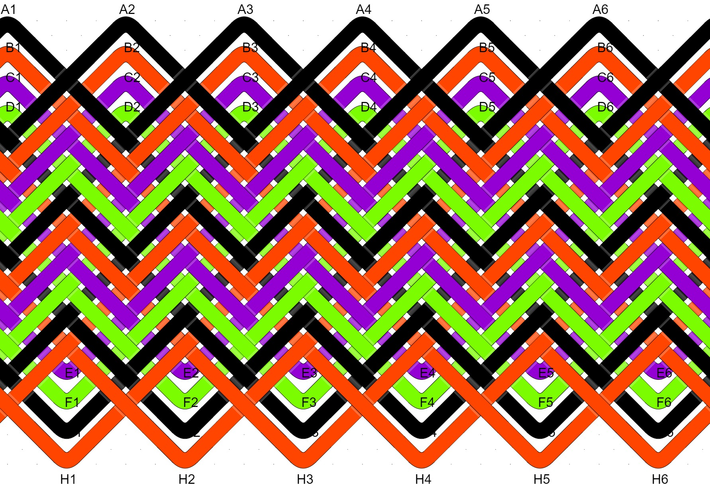
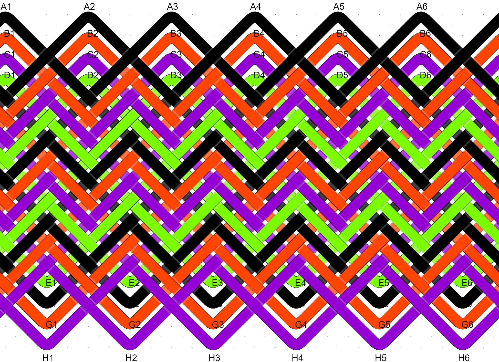
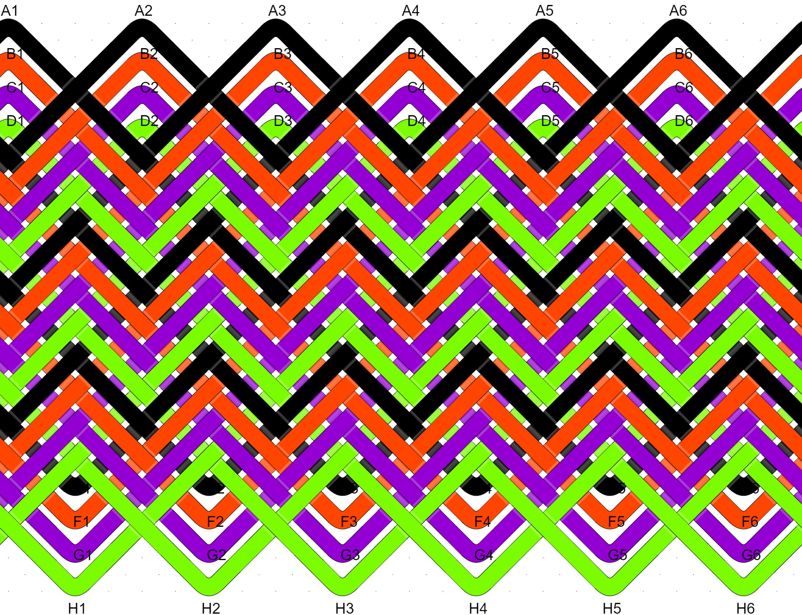

# Pineapple Knot (PK) Type Reference

Several years ago, [John Allwine](https://www.facebook.com/freakinsweetknots/) – creator of [Advanced Grid Maker](http://freakinsweetapps.com/knots/knotgrid/advanced.html) – was generous enough to help me learn about the pineapple interweave. Before you can use a tool like AGM, you need to decide how many strands or colors the knot will have and the **type** of PK you want to tie. Here’s a quick reference for 2, 3, and 4 strand PK types.

## The Big Idea

A Pineapple Knot (PK) is two or more Turk's Head knots interwoven following a specific pattern. The THKs can be the same or different sizes. 

The **'type'** of pineapple refers its number of OUTTERMOST EQALLY SIZED and STACKED Turk's Head knots. These equally sized knots may or may not surround other, smaller Turk's Head knots. 

In the images below, the order of the colors is the same - which highlights how the type is what determines the final look of the knot. 

An idea not shown in the images below is that you can describe a PK as one type surrounding another type. For example, a 5-strand type II has two equally sized THKs surrounding three smaller THKs. But how are those three arranged? 

## 2-Strand Pineapple Knots

Type I: Black is ONE LARGE THK surrounding the smaller red knot. 

{: width="200"}

Type II: Black and red are TWO EQUALLY SIZED and STACKED THKs. 

## 3-Strand Pineapple Knots

Type I: Black is ONE LARGE THK surrounding two smaller knots.

Type II: Black and red are TWO EQUALLY SIZED and STACKED THKs surrounding a smaller purple knot.  

Type III: Black, red, and purple are THREE EQUALLY SIZED and STACKED THKs. 

## 4-Strand Pineapple Knots

Type I: Black is ONE LARGE THK surrounding three smaller knots. 

Type II: Black and orange are TWO EQUALLY SIZED and STACKED THKs surrounding two smaller knots.  

Type III: Black, orange, and purple are THREE EQUALLY SIZED and STACKED THKs surrounding a smaller knot. 

Type IV: FOUR EQUALLY SIZED and STACKED THKs. 

