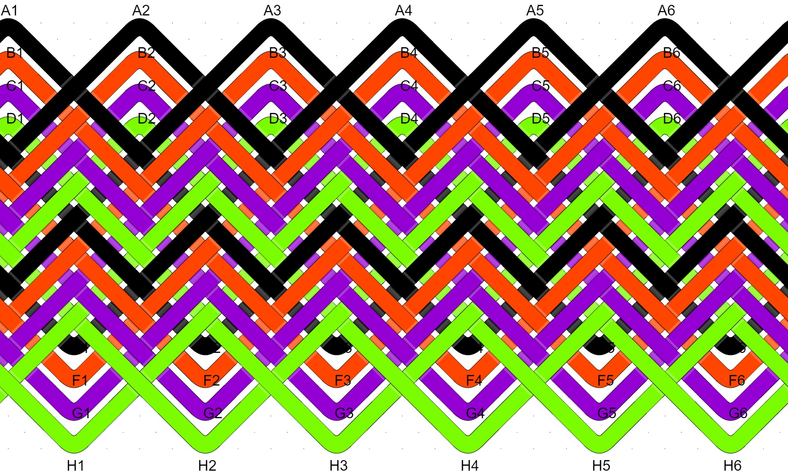

# Pineapple Knot Type Reference

A few years ago, [John Allwine](https://www.facebook.com/freakinsweetknots/) – creator of [Advanced Grid Maker](http://freakinsweetapps.com/knots/knotgrid/advanced.html) – was generous enough to help me learn about the pineapple interweave. Before you can use a tool like AGM, you need to decide how many strands or colors the knot will have and the ‘type’ of pineapple you want to tie. Here’s a quick reference for 2, 3, and 4 strand pineapple types.

## 2-Strand Pineapple Knots

**Type I**: The ONE LARGE black knot surrounds the smaller red knot. 

**Type II**: TWO EQUALLY SIZED and STAKED knots. 

## 3-Strand Pineapple Knots

**Type I**:

**Type II**:

**Type III**:

## 4-Strand Pineapple Knots

**Type I**:

**Type II**:

**Type III**:

**Type IV version A**:

**Type IV version B**:

