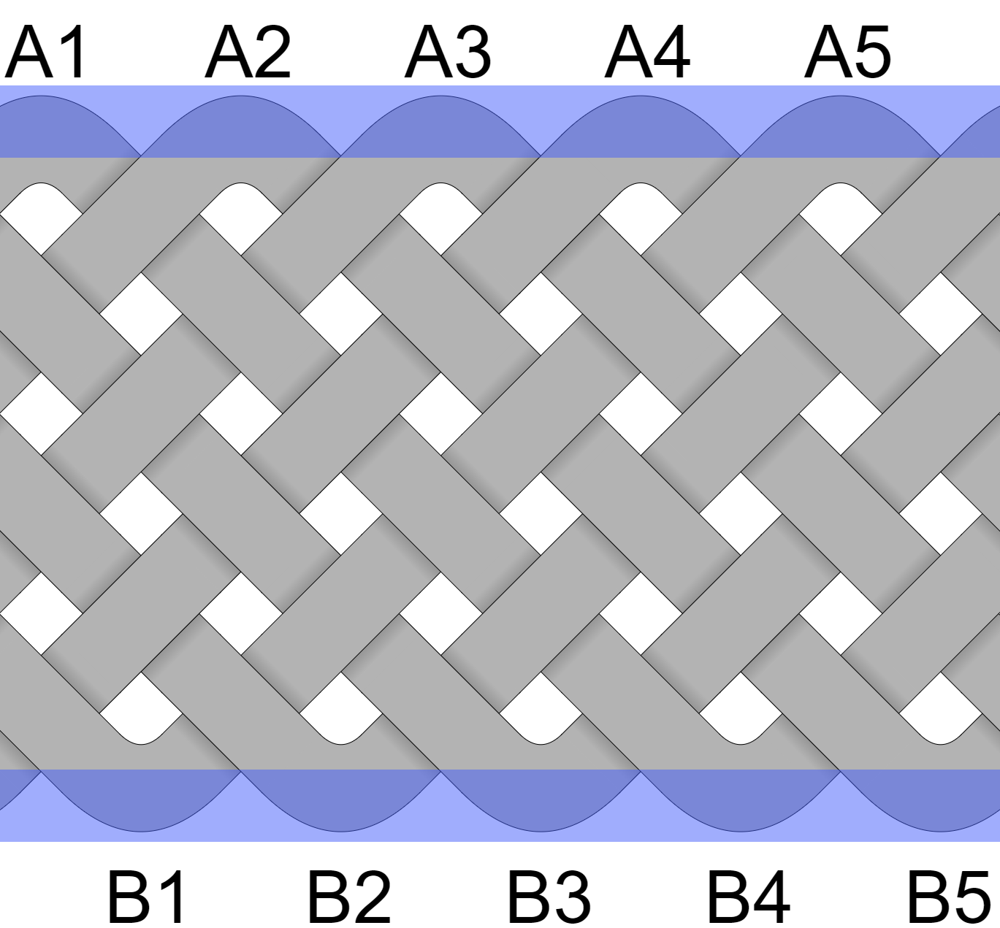
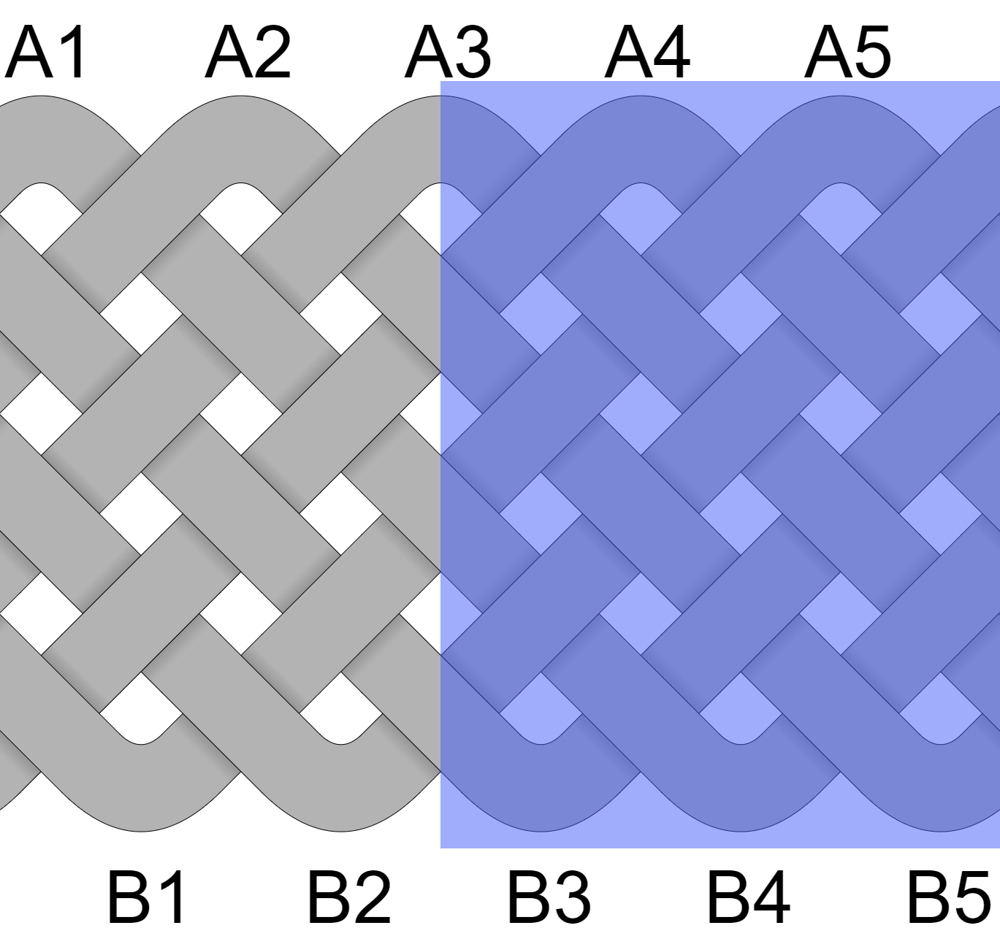
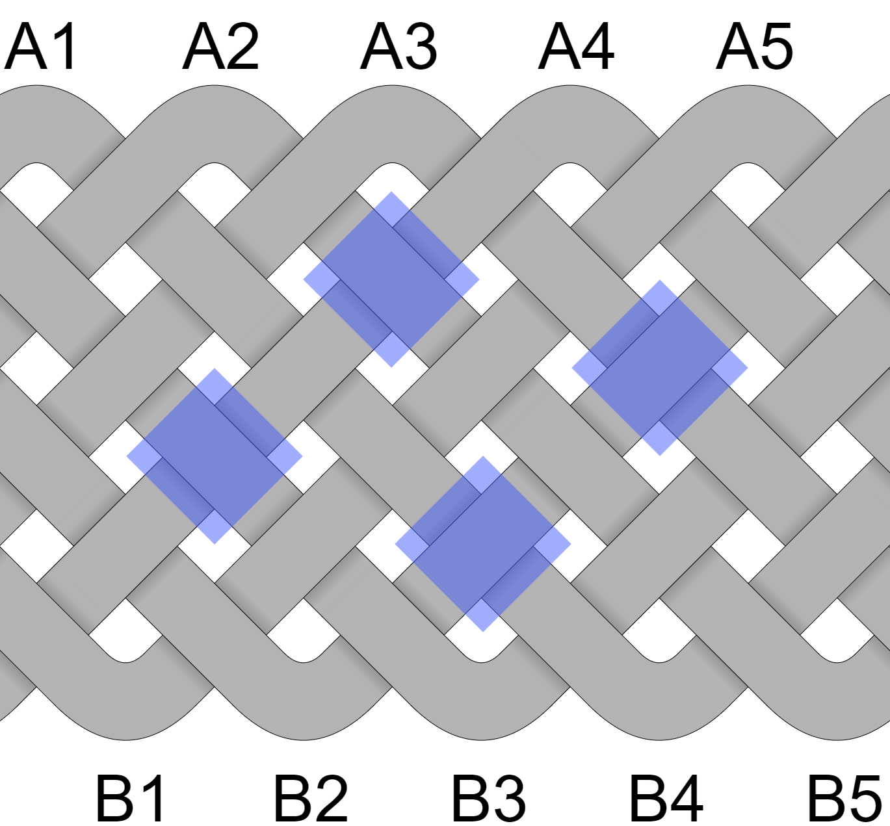
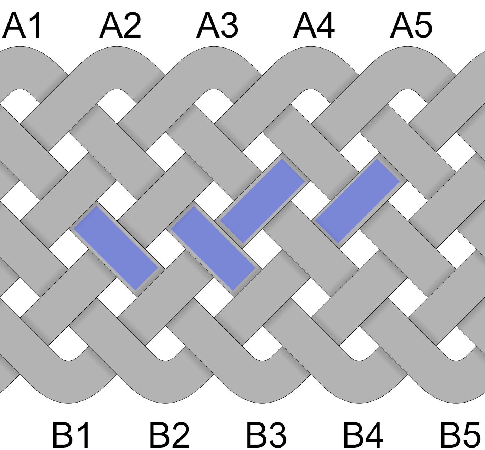

# Bights, Parts, Crossings, Facets

Before diving into specific knots & concepts, it helps to understand what's being described. 

## Bights

Bights are the turning points at the outer edge of a knot or interweave. This knot has 5 bights.

## Parts (Leads)

Imagine cutting the knot vertically. Parts are the number of strands you need to cut. This knot has 7 parts. 

## Crossings

Crossings are the places where 2 visible cords cross. This knot has 30 crossings.

## Facets

Facets are the visible overs - or faces -  of cord. This knot has 30 facets. 

