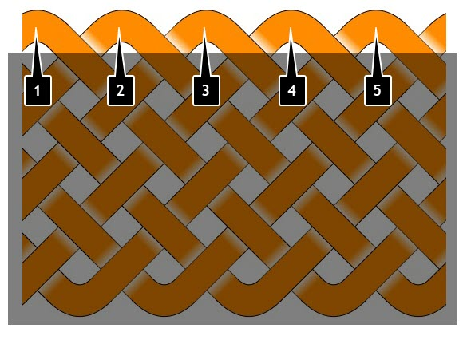

# Bights & Parts

Counting bights is easy, but counting parts is something I struggled with until I stumbled across one simple explanation – I wish I could remember where. Since it’s helped me a lot and may help you, here’s how to count the bights & parts (leads) using a 5B 7P Turk’s Head as an example.

## Bights (Leads)

Bights are the simplest to understand – I think of them as the turning points at the outer edge of a knot or interweave.

## Parts

To count parts, imagine cutting the knot vertically. Parts are the number of strands you need to cut. Brilliant, right?

