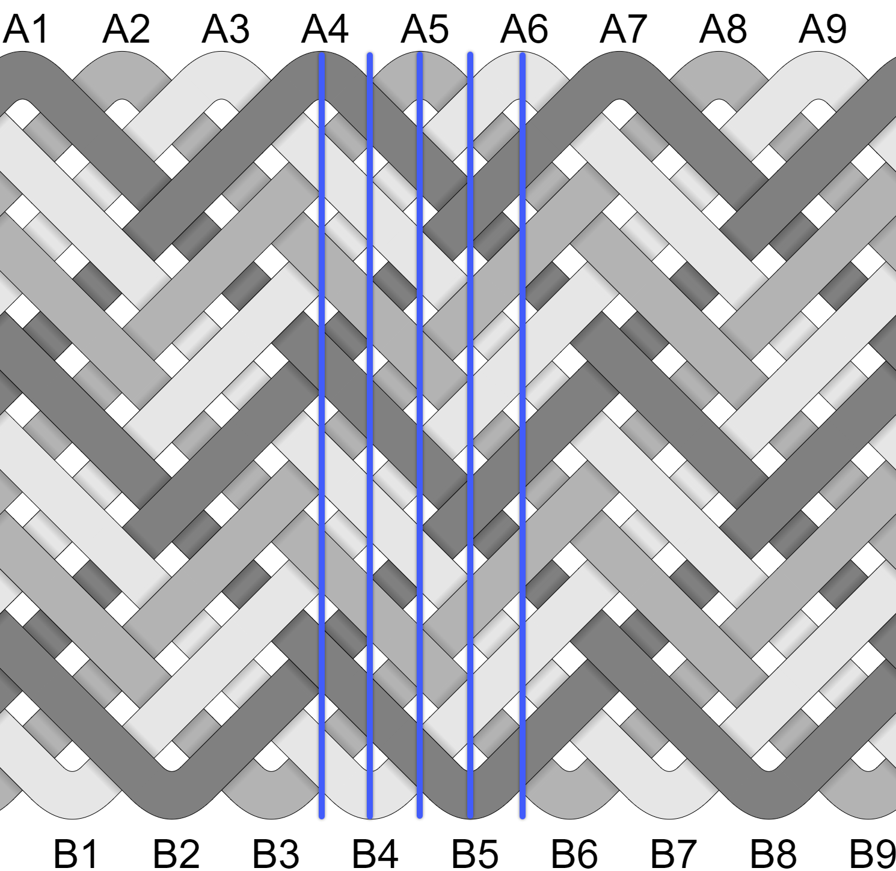
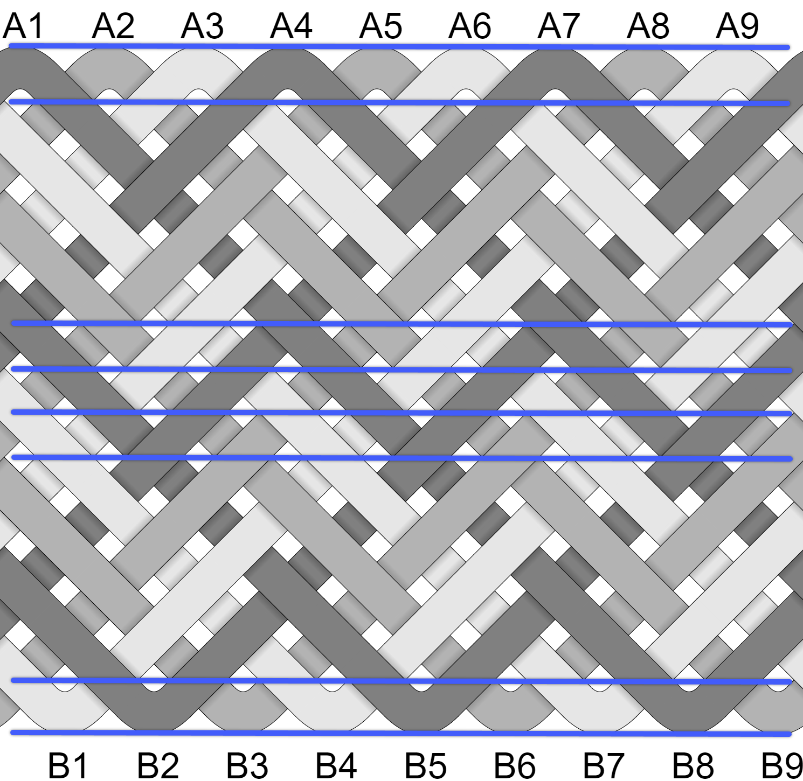
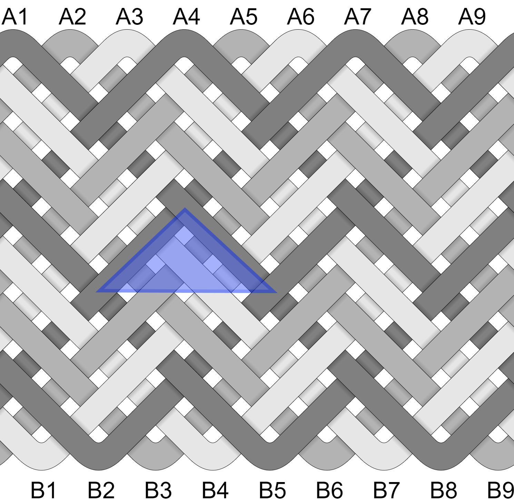
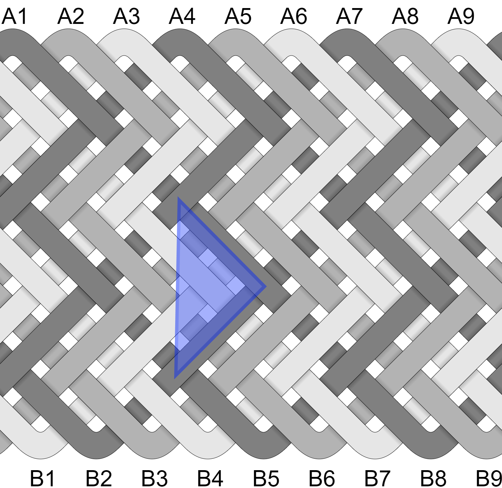
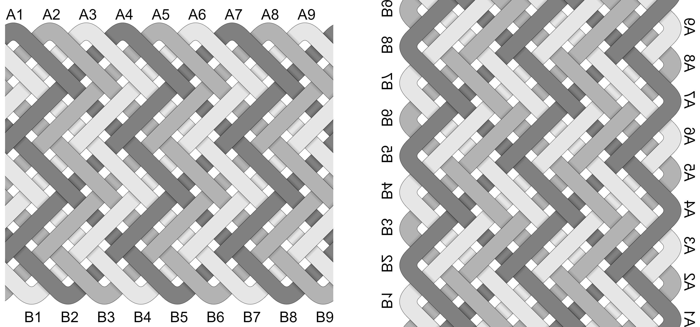
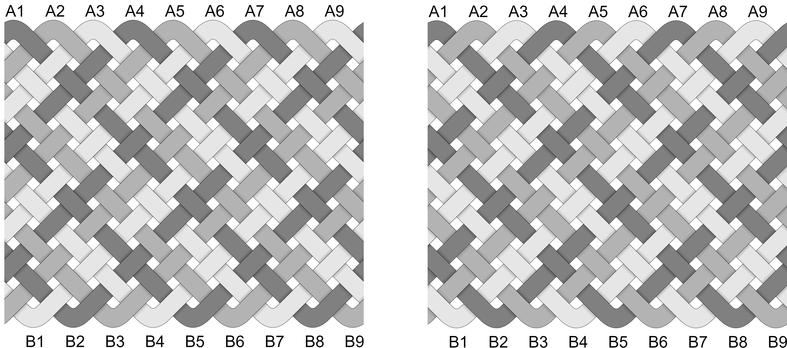

# Columns, Rows, and Coding

Cylindrical knots are designed on a grid. The size of a knot can be described as having some number columns & rows. A knot is ether column coded or row coded. 

Columns, rows, and coding are key to a knot's structure - understanding them can help you: 

* Determine if a knot you want to tie is possible and if not, find the nearest one that is. 
* Look at completed knots and deconstruct them.
* Start with a certain size Turk's Head in mind and go from there. 

I never thought I'd get it and I'm still learning. I'm also happy to say that the math underpinning cylindrical knots isn't complicated. What follows are visual examples and a layperson's way of recognizing things - I hope they help.

## How to Count Columns & Rows

A cylindrical knot has 2 columns for each bight. This knot has 9 bights and 18 columns.

For Fan Knots, rows = parts + 1. This knot has 15 parts and 16 rows. 

The math is a little different for Pineapples & other knots with [nested & shifted bights](). 

## Column Coding

This is a 3-strand Fan with column coding - often called Herringbone. The triangles are pointing up. The triangle bases are horizontal and span columns.

## Row Coding

This is a 3-strand Fan with row coding - often called Gaucho. The triangles are pointing to the right. The triangle bases are vertical and span rows. 

## Look Close

This is just something I find interesting - it's a study in the similarities and differences between row & column coding.

The knot on the left is row coded. The knot on the right is column coded, rotated 90 degrees CV, and flipped vertically. They're very similar - if tied with a single strand, they'd be hard to tell apart. But by adding color and expanding the gaps, we see the paths are different. 

The 3-strand knots below uses a simple OU pattern. The left is row coded and the right is column coded. Even without rotating or flipping, they are similar. Again, tied with a single strand they'd be difficult to distinguish and it's the color & gaps that highlight the different paths. 

