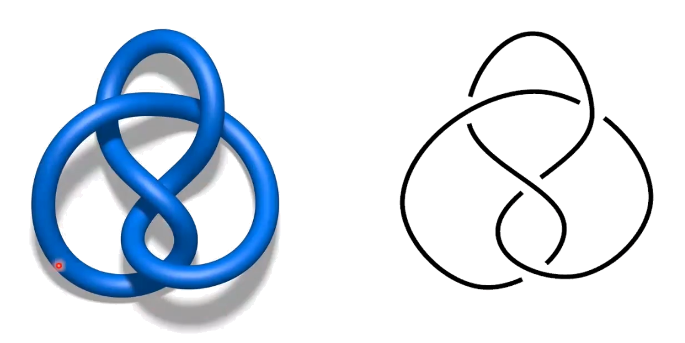
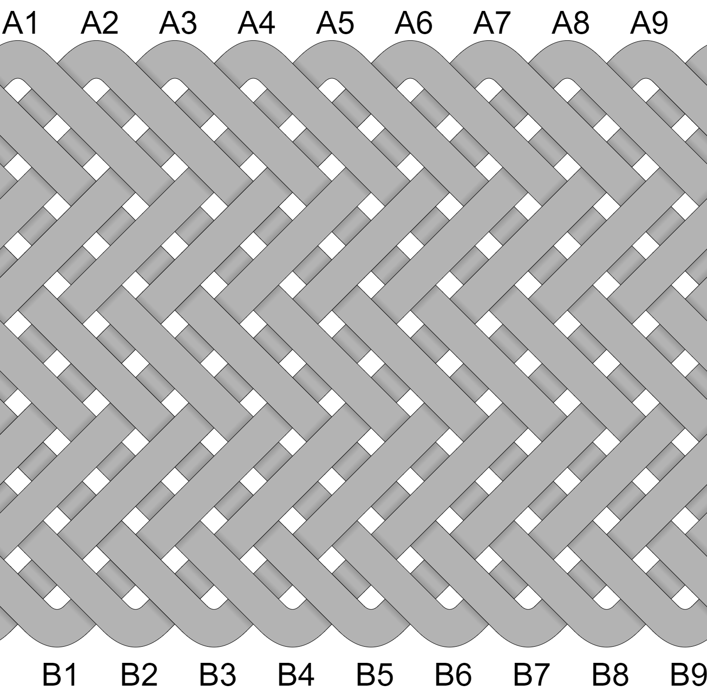
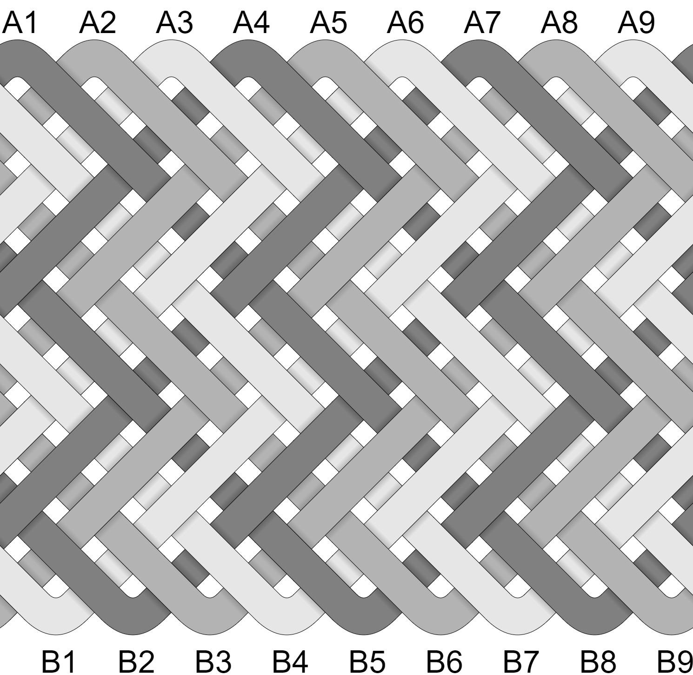

## Knot vs Interweave 

* A **real-world knot** has open ends. 
* A **mathematical knot** is a single, continuous loop - it has closed ends.

If you can take a form's real-world working & standing ends and join them to make a single loop, then the rules of mathematical knots apply. 

## No Real Difference for Tying

Technically, a single-strand **knot** tied with multiple **passes** is different than an **interweave** tied with multiple **strands**. 

For tyers, the distinction is mostly academic. Mathematically, a 1-strand knot with 2 passes is the same as a 2-strand interweave - it has the same number of bights, parts, columns, rows, crossings, and facets. 

The only difference between a knot and interweave is if the pattern is completed as a single path or as multiple paths. 

Functionally, the choice to use multiple strands will come down to 3 things:

* You want to use multiple colors.
* You prefer tying with multiple, shorter strands.
* You only have shorter strands. 

Stated another way, an interweave is a series of what are called **linked knots** - you could join the working and standing ends of all strands in a way that does form a single loop. 

## Doubling & Tripling

When you 'double' or 'triple' a knot, you are following an existing path & pattern additional times. Mathematically, the knot is unchanged - it has the same number of bights, parts, and so on. 

This is different from making 'passes' which have their own paths. And its different from an 'interweave' where each strand builds the pattern. Passes, paths, and patterns are inherent to the math - changes to these do change bights, parts, and so on. 

## Example

This is a Gaucho Fan Knot - it's tied with 1 strand that makes 3 passes. 

This is a Gaucho Fan interweave - it's tied with 3 strands that make 1 pass each.

