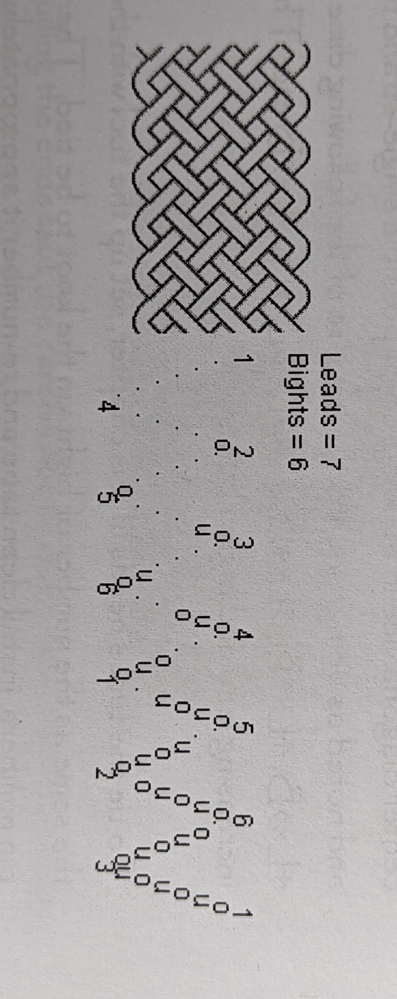

# How to Read Knot Instructions

I'm a person who needs exact instructions to tie any knot. When I first started, I had a hard time understanding how to read the different types of instructions I came across. I kept struggling until one day I committed to figuring out how it works. 

I did it using a 7L 6B Turk's Head tied on a mandrel. I followed a video to tie the knot and compared each step to 3 different types of instructions. And I just kept looking until I got it. 

It's not as hard as I thought it would be, and it let me start doing more complex knots. What follows is everything you need to try the same exercise - happy tying!

## Video

[https://youtu.be/624mjBNKYtU](https://youtu.be/624mjBNKYtU)

<iframe width="560" height="315" src="https://www.youtube.com/embed/624mjBNKYtU" title="YouTube video player" frameborder="0" allow="accelerometer; autoplay; clipboard-write; encrypted-media; gyroscope; picture-in-picture" allowfullscreen></iframe>

## Cookbook Style Instructions

Instructions from ***Turk's Head Cookbook*** by Don Burrhus. 




## AGM Style Dotted Instructions

```
From A1      . . . . . .      to B4
From B4      . . . . . O      to A2
From A2      . . . . . O      to B5
From B5      . . . . U O      to A3
From A3      . . . . U O      to B6
From B6      . . . O U O      to A4
From A4      . . . O U O      to B1
From B1      . . U O U O      to A5
From A5      . . U O U O      to B2
From B2      . O U O U O      to A6
From A6      . O U O U O      to B3
From B3      U O U O U O      to A1
```

## AGM Style Consolidated Instructions

```
From A1           to B4
From B4      O1      to A2
From A2      O1      to B5
From B5      U1 O1      to A3
From A3      U1 O1      to B6
From B6      O1U1 O1      to A4
From A4      O1U1 O1      to B1
From B1      U1 O1U1 O1      to A5
From A5      U1 O1U1 O1      to B2
From B2      O1U1 O1U1 O1      to A6
From A6      O1U1 O1U1 O1      to B3
From B3      U1 O1U1 O1U1 O1      to A1
```

