# Pineapple Knot Type Reference

Several years ago, [John Allwine](https://www.facebook.com/freakinsweetknots/) – creator of [Advanced Grid Maker](http://freakinsweetapps.com/knots/knotgrid/advanced.html) – helped me learn about the Pineapple Knot (PK). Before you can use a tool like AGM, you need to decide how many strands (passes) the knot will have and the type of PK you want to tie. Here’s a quick reference explaining Pineapple types. 

## The Big Idea

A Pineapple has 2 or more strands (passes). Each strand is a Turk's Head. The THKs can be the same size or different sizes. The **TYPE** of Pineapple refers to its number of **OUTTERMOST, EQALLY SIZED, and STACKED** Turk's Heads. These THKs may or may not surround other, smaller THKs. 

The following images introduce strands from dark to light. Notice that:

* The darkest strand is always a 4B 7P Turk's Head.
* The darkest strand is always the largest knot. Other strands are either the same size or smaller. 
* The smaller THKs are always equally sized and stacked. 
* The color order for the top bights is the same regardless of type. 
* Meaning, it's the **ORDER of the BOTTOM BIGHTS** that determines the type. 

## Type = Strands (Passes)

One of the easiest Pineapples to recognize is when all the THKs are equally sizes and stacked like chairs. In this case, the type equals the number of strands (passes). From left to right these knots are type 2, 3, and 4.  

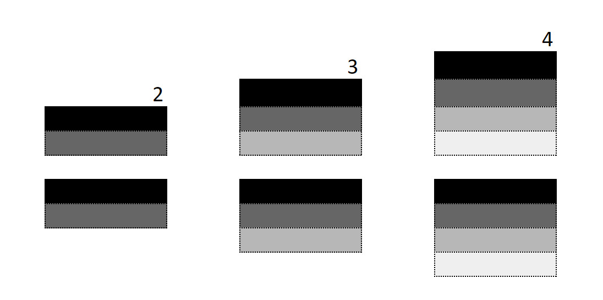

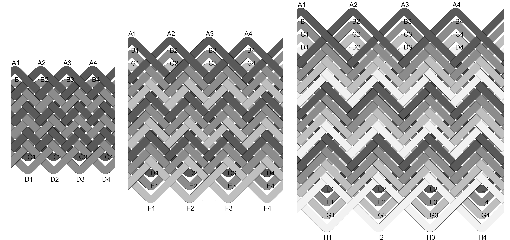

## Type 1

Type 1 Pineapples are also easy to recognize - the darkest strand is 1 large THK surrounding smaller THKs. 

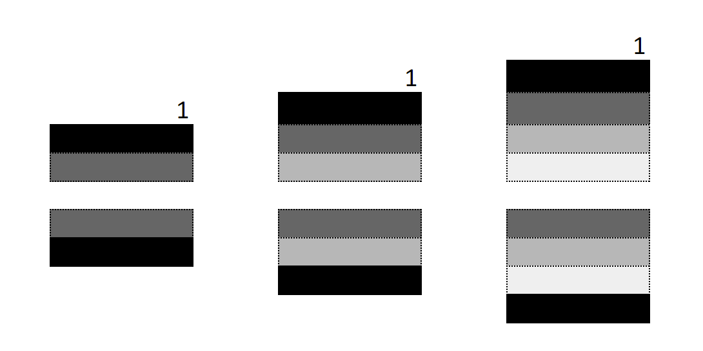

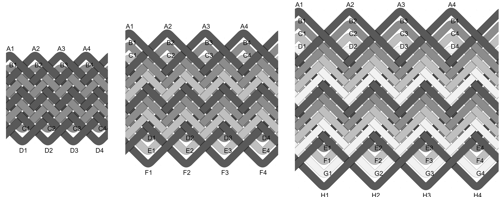

## Type 2

A type 2 Pineapple has 2 equally sized and stacked THKs. Notice the smaller THKs in the 3 and 4 strand images. 

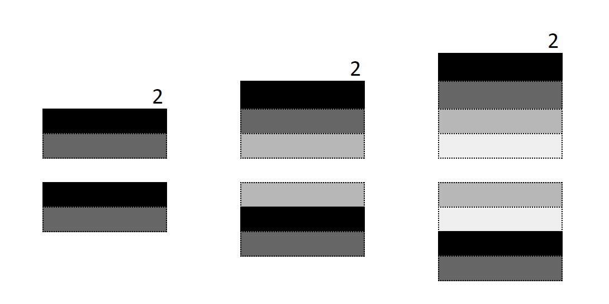

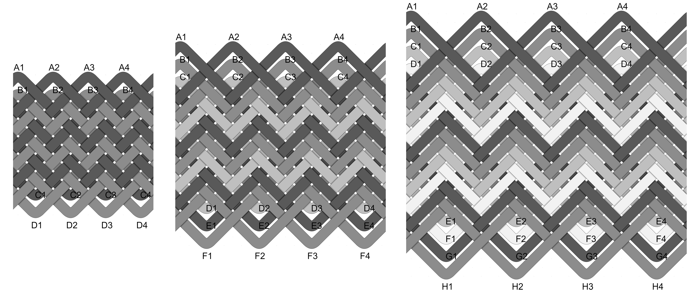

## Type 3

A type 3 Pineapple has 3 equally sized and stacked THKs. Notice the smaller THK in the 4 strand image. 

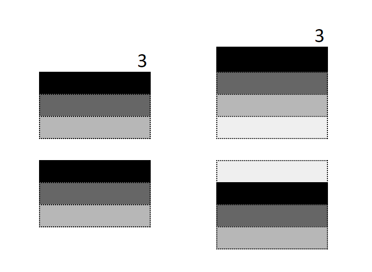

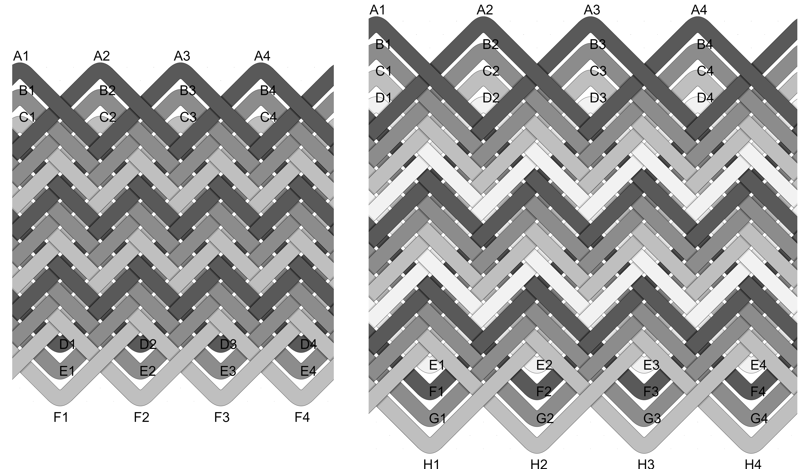

## 2-Strand (Pass)

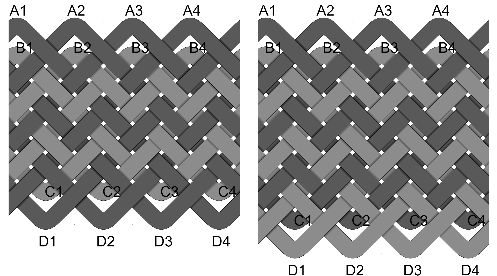

## 3-Strand (Pass)

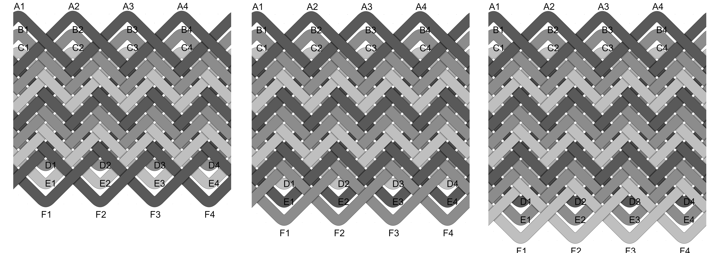

## 4-Strand (Pass)

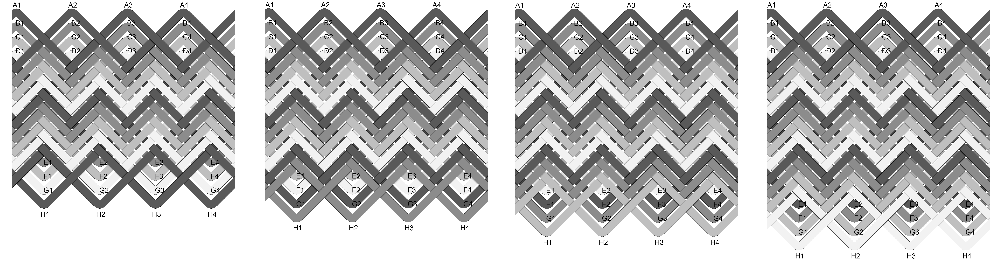

