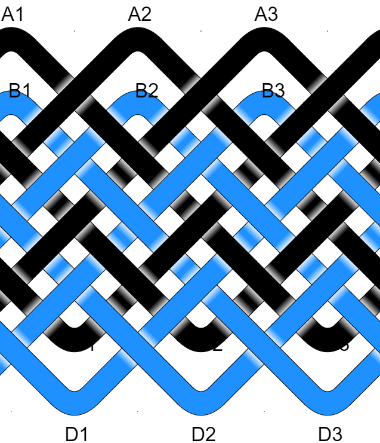

# Pineapple Knot : 2 Strands : 3B 5P : Type II 




## Un-Consolidated Instructions

```
Strand 1 (Black)
From A1   . . . . . . . . .   to C3
From C3   . . . . . U . . .   to A3
From A3   . . . . . U . . .   to C2
From C2   . U . . . U . O .   to A2
From A2   . U . . . U . O .   to C1
From C1   . U . O . U . O .   to A1

Strand 2 (DodgerBlue)
From B1   U . O . U . O . .   to D3
From D3   . . O . U U O . U   to B3
From B3   U . O . U U O . .   to D2
From D2   . U O . U U O O U   to B2
From B2   U U O . U U O O .   to D1
From D1   . U O O U U O O U   to B1
```

## Consolidated Instructions

```
Strand 1 (Black)
From A1                to C3
From C3   U1           to A3
From A3   U1           to C2
From C2   U2 O1        to A2
From A2   U2 O1        to C1
From C1   U1 O1U1 O1   to A1

Strand 2 (DodgerBlue)
From B1   U1 O1U1 O1     to D3
From D3   O1U2 O1U1      to B3
From B3   U1 O1U2 O1     to D2
From D2   U1 O1U2 O2U1   to B2
From B2   U2 O1U2 O2     to D1
From D1   U1 O2U2 O2U1   to B1
```

## AGM Settings

```
Column Coding: OUUO
Colors: Black DodgerBlue
Pineapple Grid
Nested Bights: 2
Shifted Bights: 1
Image Rows: 13
Image Columns: 12
Image Parts: 10
Image Bights: 6
```

## AGM Knot Data

```
^*.*^*.*^*.*
*\*/*\*/*\*/
^*X*^*X*^*X*
*X*X*X*X*X*X
X*X*X*X*X*X*
*X*X*X*X*X*X
X*X*X*X*X*X*
*X*X*X*X*X*X
X*X*X*X*X*X*
*X*X*X*X*X*X
X*v*X*v*X*v*
*\*/*\*/*\*/
.*v*.*v*.*v*
Coding:
OUUOOUUOOUUO
OUUOOUUOOUUO
OUUOOUUOOUUO
OUUOOUUOOUUO
OUUOOUUOOUUO
OUUOOUUOOUUO
OUUOOUUOOUUO
OUUOOUUOOUUO
OUUOOUUOOUUO
OUUOOUUOOUUO
OUUOOUUOOUUO
OUUOOUUOOUUO
OUUOOUUOOUUO
```

