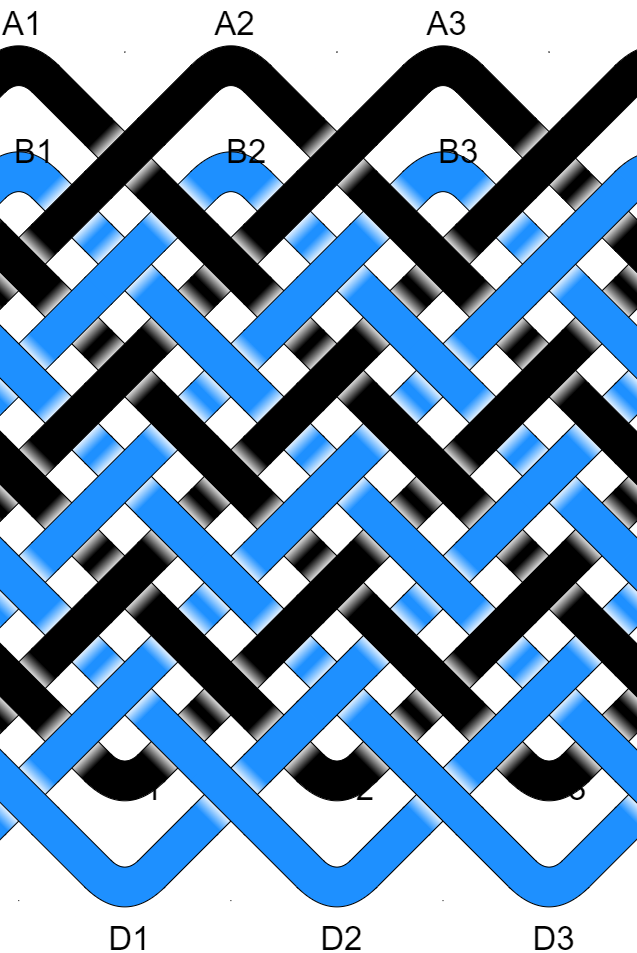

# Pineapple Knot : 2 Strands : 3B 7P : Type II 




## Un-Consolidated Instructions

```
Strand 1 (Black)
From A1      . . . . . . . . . . . . .      to C1
From C1      . . . . . U . . . . . O .      to A2
From A2      . . . . . U . . . . . O .      to C2
From C2      . . . O . U . . . U . O .      to A3
From A3      . . . O . U . . . U . O .      to C3
From C3      . U . O . U . O . U . O .      to A1

Strand 2 (DodgerBlue)
From B1      U . O . U . O . U . O . .      to D1
From D1      . . O . U U O . U . O O U      to B2
From B2      U . O . U U O . U . O O .      to D2
From D2      . . O O U U O . U U O O U      to B3
From B3      U . O O U U O . U U O O .      to D3
From D3      . U O O U U O O U U O O O      to B1

```

## Consolidated Instructions

```
Strand 1 (Black)
From A1       around 1x     to C1
From C1      U1 O1      to A2
From A2      U1 O1      to C2
From C2      O1U2 O1      to A3
From A3      O1U2 O1      to C3
From C3      U1 O1U1 O1U1 O1      to A1

Strand 2 (DodgerBlue)
From B1      U1 O1U1 O1U1 O1      to D1
From D1      O1U2 O1U1 O2U1      to B2
From B2      U1 O1U2 O1U1 O2      to D2
From D2      O2U2 O1U2 O2U1      to B3
From B3      U1 O2U2 O1U2 O2      to D3
From D3      U1 O2U2 O2U2 O3      to B1
```

## AGM Knot Data

```
^*.*^*.*^*.*
*\*/*\*/*\*/
^*X*^*X*^*X*
*X*X*X*X*X*X
X*X*X*X*X*X*
*X*X*X*X*X*X
X*X*X*X*X*X*
*X*X*X*X*X*X
X*X*X*X*X*X*
*X*X*X*X*X*X
X*X*X*X*X*X*
*X*X*X*X*X*X
X*X*X*X*X*X*
*X*X*X*X*X*X
X*v*X*v*X*v*
*\*/*\*/*\*/
.*v*.*v*.*v*
Coding:
OUUOOUUOOUUO
OUUOOUUOOUUO
OUUOOUUOOUUO
OUUOOUUOOUUU
OUUOOUUOOUUO
OUUOOUUOOUUO
OUUOOUUOOUUO
OUUOOUUOOUUO
OUUOOUUOOUUO
OUUOOUUOOUUO
OUUOOUUOOUUO
OUUOOUUOOUUO
OUUOOUUOOUUO
OUUOOUUOOUUO
OUUOOUUOOUUO
OUUOOUUOOUUO
OUUOOUUOOUUO
```

